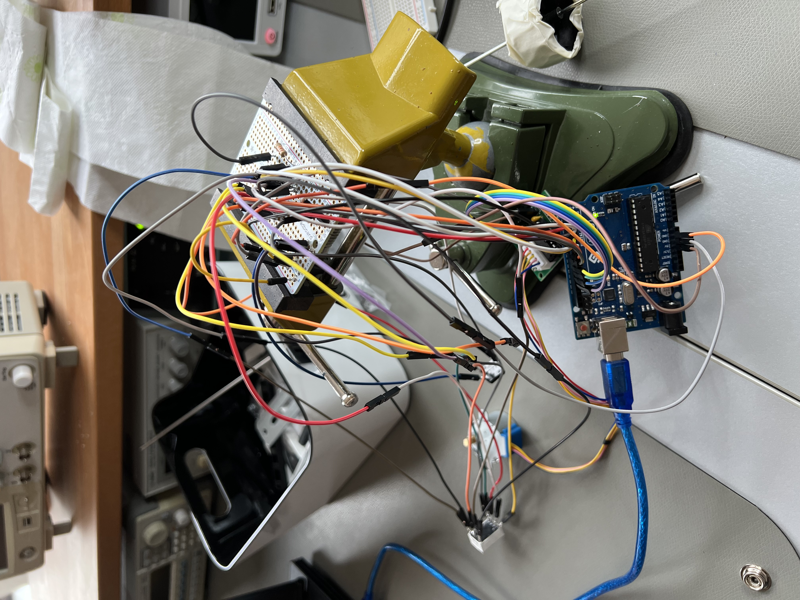
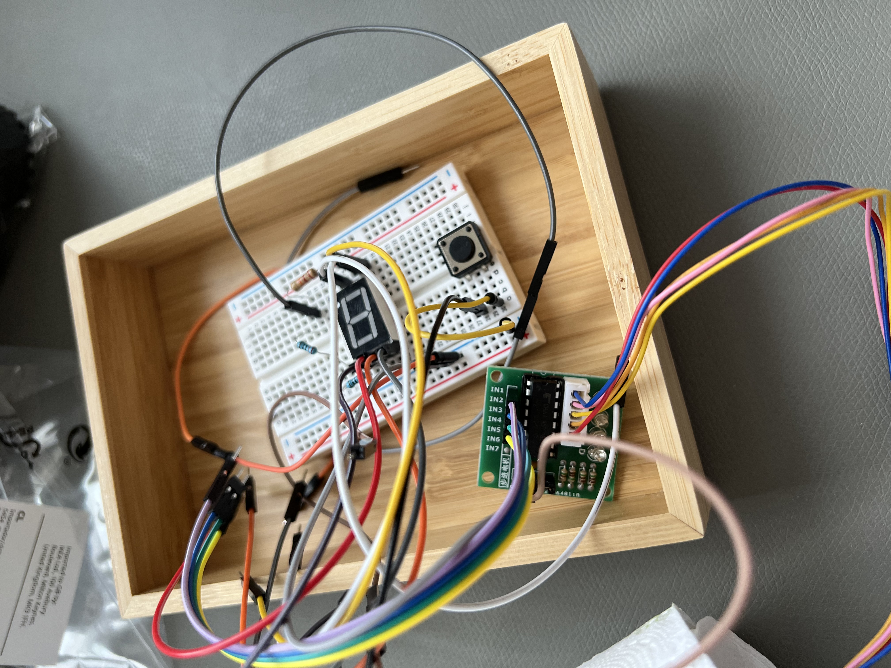
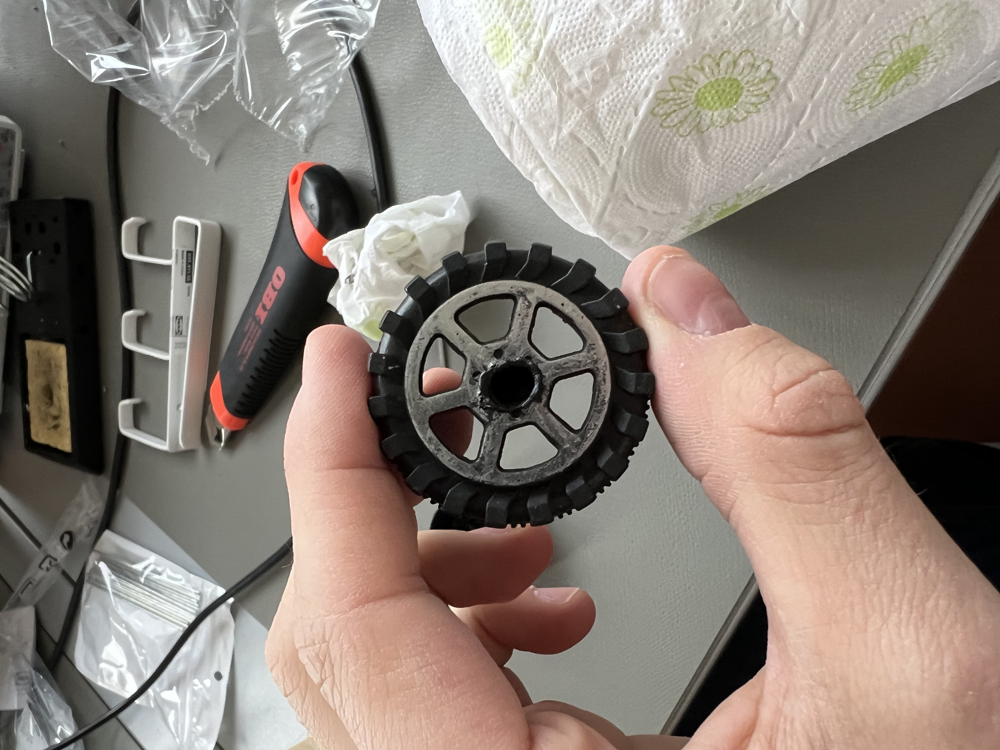
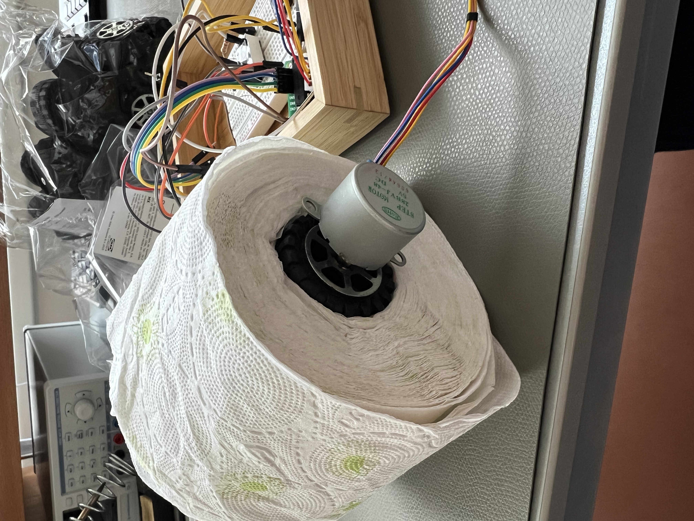
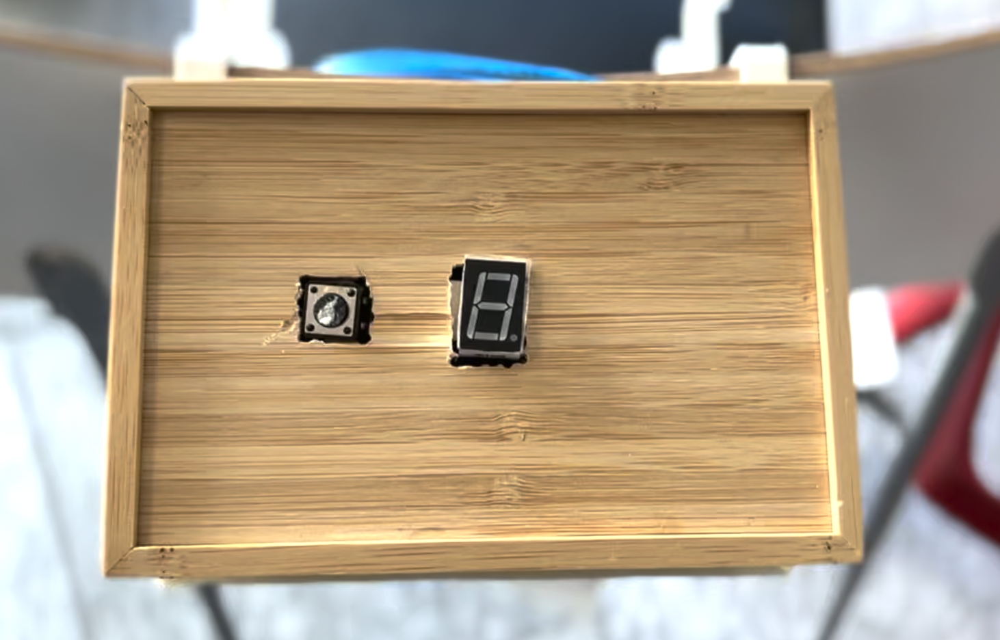
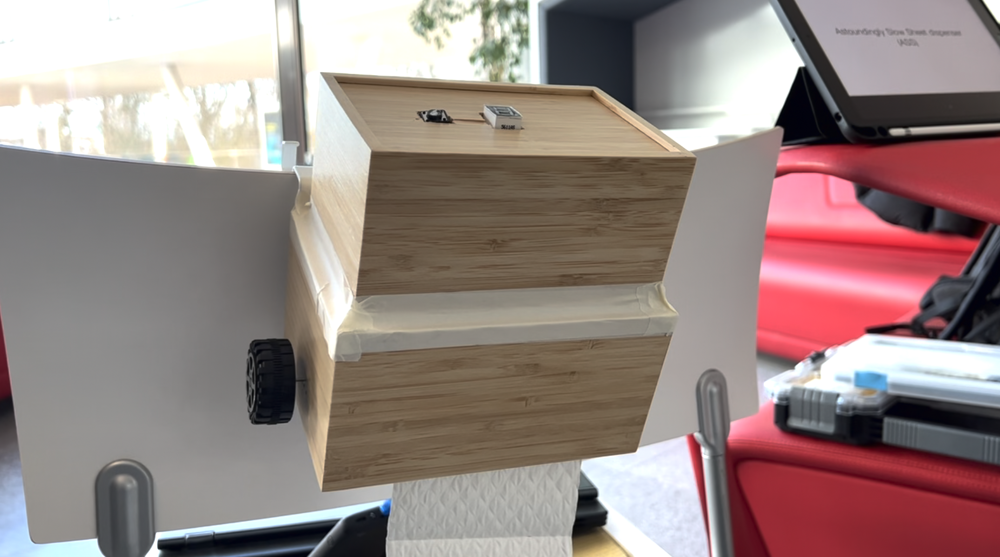

# A.S.S.

Project documentation for the **Design for Physical Prototyping** course 2022/23 focusing on the topic of **Uncomfortable Devices**.

## Abstract
The idea is to build an automatic toilet paper dispenser that dispenses a sheet of toilet paper by pressing a button. To make the whole thing even more uncomfortable the user has to wait 10 seconds after each button press. Pretty uncomfortable in a fast paced world, especially when there is an appointment in a few minutes.

## Ideation
Our initial Idea was a "Japanese toilet" that communicates with the user but since we would have needed an actual toilet for the prototype, we decided to look for another uncomfortable cleaning device. Somehow, our new idea brought us back to the toilet but this time, the idea was actually feasible to implement in a prototype. We want to create a toilet paper dispenser that provides the user with one sheet of toilet paper with the press of a button. To make things even more uncomfortable, we want the function to have a sizeable cooldown. Other ideas like the mobile phone as a power source for the dispenser did come up but the final product does not have this implementation. It is however possible to power A.S.S. with a simple power bank which makes the device fully portable for those who want the possibility to torture themselves by waiting an exorbitant amount of time to wipe, not just at home but on the road and wherever they see fit.

## Exhibition
Because of the relative simplicity of the device when compared to other projects that implemented speakers and even apps, the presentation was relatively straight forward. A.S.S. was attached to the back of a chair and a small stool acted as a pretend toilet for everyone who wanted to try the device. One would sit on the stool and press the button at the top of A.S.S. which lowered about one sheet of toilet paper from the open bottom of the device. After this press the person would have to wait ten seconds for the button to be activated again, which is indicated by a display at the top which counts down from nine to zero. Most people that tried the prototype tried to trick the system by pressing the button multiple times while the timer was still running but no one managed to get more toilet paper without waiting for the time to pass. In our explanation of the device, the environment as well as the need to save toilet paper regarding the recent covid pandemic and the resulting scarcity of toilet tissues was mentioned. As remarked in the presentation however, the actual usefulness of A.S.S. in this context has to be questioned since about half the toilet paper has to be removed from the role for the roll to fit inside the device.

## Implementation

The team was tasked with creating a mechanism for an automatic toilet paper dispenser. The goal was to design a system that would dispense one sheet of toilet paper with the press of a button. After researching several options, the team decided to use a servo motor connected to an Arduino.

### Design, materials and tools
The team began by designing the dispenser housing. This included designing the form factor, material selection, and size. A wooden box served as housing. Subsequently, the team began to plan out the internal components.

The team first determined the best way to attach the servo motor. After some research, it was decided to use a built-in bracket to attach the servo motor to one side of the housing. On the opposite side, a small hole was drilled to hold the axle.

The axle was then connected to two toy car tires, to allow for smooth rotation of the axle. To ensure that the axle and tires would fit together, a gap was melted into the tire and the axle was inserted.

### Assembly
Once the components were designed and fabricated, the team began the assembly process. The servo motor was attached to the housing using the built-in bracket. The axle was then inserted into the small hole drilled in the housing. The toy car tires were then connected to the axle and integrated into the toilet paper roll.

### Testing
Once the assembly was completed, the team began testing the dispenser. It took a while to create a firm fundament. First the servo motor was tested to make sure that it was able to rotate the axle and dispense the toilet paper. Then, the button was tested to make sure that it was able to send the signal to the Arduino, which in turn would activate the servo motor and dispense the toilet paper. 

### Struggles and insights

Of course, a project of this complexity is bound to run into some struggles and things that do not work out as planned. Initially, the housing for the toilet paper as well as the technical stuff like the Arduino was supposed to be 3D printed. But after realizing that the deadline was rapidly approaching and still not knowing the exact measurements, we need to house all the cables, a simpler solution was found. This solution came in the form of two wooden boxes with the bigger one housing the toilet paper as well as the motor and the smaller one storing the rest of the technical components. Those two boxes are attached to each other with tape so if something has to be adjusted, that is easily manageable. 

One of the biggest challenges in for this prototype to work was how the toilet paper roll would be attached to the motor in order for the motor to turn the roll. Initially the plan was to 3D print something that would fit on the motor and inside the roll perfectly but that ideas was abandoned for the reasons stated above and because a discovery was made that not all toilet paper rolls have the same diameter which meant that a more flexible solution had to be found. The next was mainly meant to test whether or not the motor would be strong enough to move the toilet paper roll. Here, the shell of a big ball point pen was used together with blistering plaster and dish sponges. This iteration worked surprisingly well but for the final product, something more elegant and reliable had to be found. The solution was to order wheels for toy cars of amazon. These wheels were used in combination with tape on either side of the toilet paper roll as well as one wheel on the outside to hold a small steel pole in place on which the roll would turn. One of the wheels had to be adjusted for the motor to hold inside. This was done by cutting out the appropriate amount of plastic. The plastics inherent nature and the sheer number of wheels available meant that experimentation was possible without having to wait excruciatingly long for another 3D print to finish which is why at the end of the day these more creative solutions were chosen.

A small problem arose when the soldering process was presumed to be finished because to the dismay of everyone, the seven-segment display used to display the time until the button is usable again did not work properly. However, this problem was resolved quite swiftly by studying the used components and by moving three cables in total. One issue that was resolved almost at the eleventh hour was how the prototype could be attached to a wall like surface. After scouring through the available items however, superglue and some metal parts were used to make it possible for the device to be attached to small horizontal surfaces such as the back of a chair or a small but sturdy steel pole. 
The name for the device also came to be at the eleventh hour when the question came up whether or not the prototype had already been given a name. The idea of using an acronym was agreed upon rather quickly and after a short discussion the name "A.S.S." which stands for "Astonishingly Slow Sheet-Dispenser" was born. Such a vulgar acronym was not chosen lightly to make fun of the situation but to emphasize the connection to a toilet environment since the foyer of the FH Hagenberg and a black stool will most likely not make people think of a toilet immediately. 

## Conclusion
The idea was to create a toilet paper dispenser that provides the user with one sheet of toilet paper with the press of a button. After the button press the person would have to wait ten seconds for the button to be activated again, which is indicated by a display at the top which counts down from nine to zero.

A wooden box served as housing. A servo motor was attached to the housing using the built-in bracket. An axle was then inserted into the small hole drilled in the housing. Toy car tires were then connected to the axle and integrated into the toilet paper roll. The axle was then connected to two toy car tires, to allow for smooth rotation of the axle. To ensure that the axle and tires would fit together, a gap was melted into the tire and the axle was inserted.

In conclusion, this project was an extremely educational and fun experience. We learned a great deal about electrical engineering, Arduino, teamwork, and how to conceive and develop a project. We had a great time working together on this project and it was a valuable learning experience for all involved. We are thankful for the opportunity to work on this project, and it was a great success.
