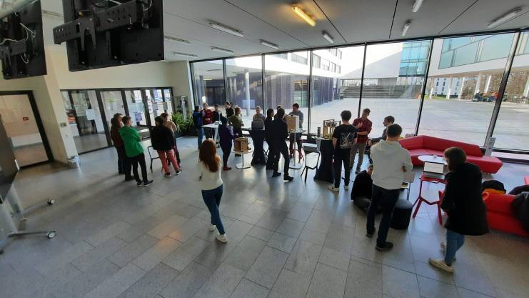

# Design for Physical Prototyping

## Project Collection

This website is a collection of projects done as part of the Design for Physical Prototyping course, winter semester 2022 in Interactive Media.
This years topic is **Uncomfortable Devices** and focuses on the *dark* side of Interaction Design.

